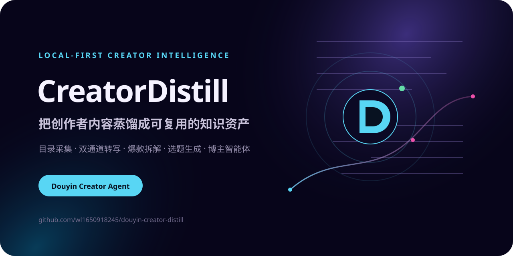
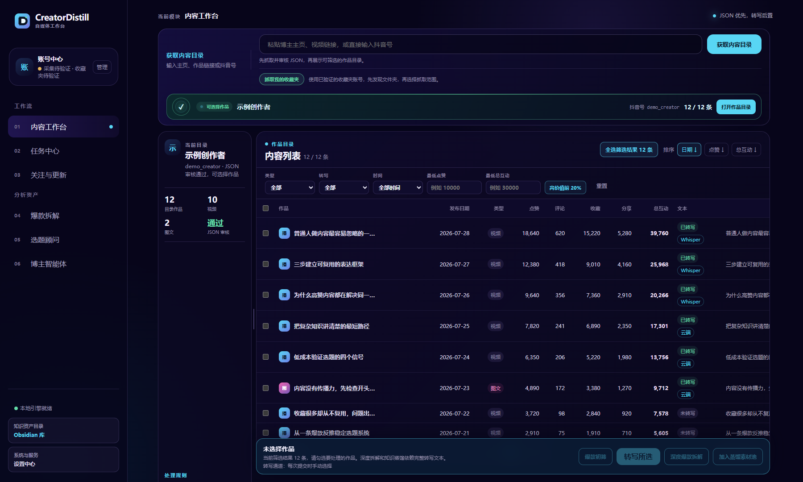
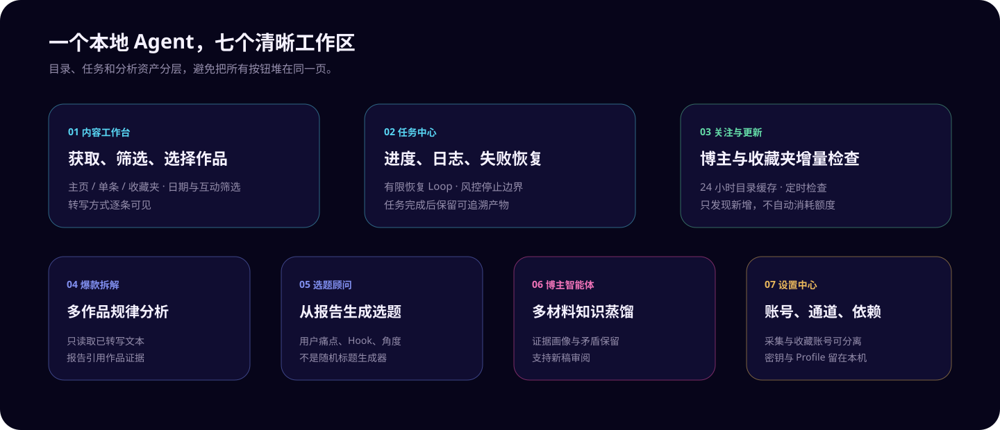
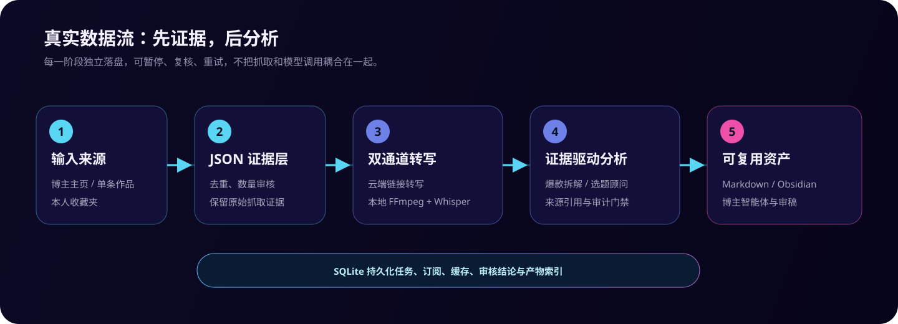
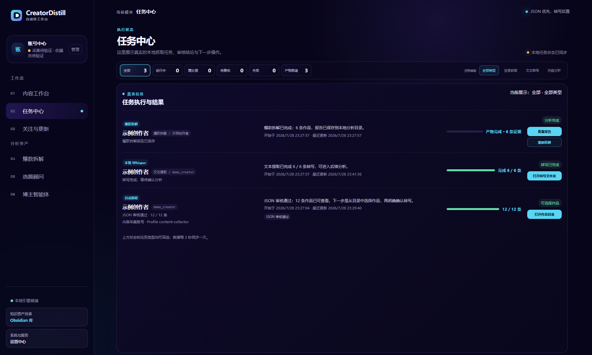
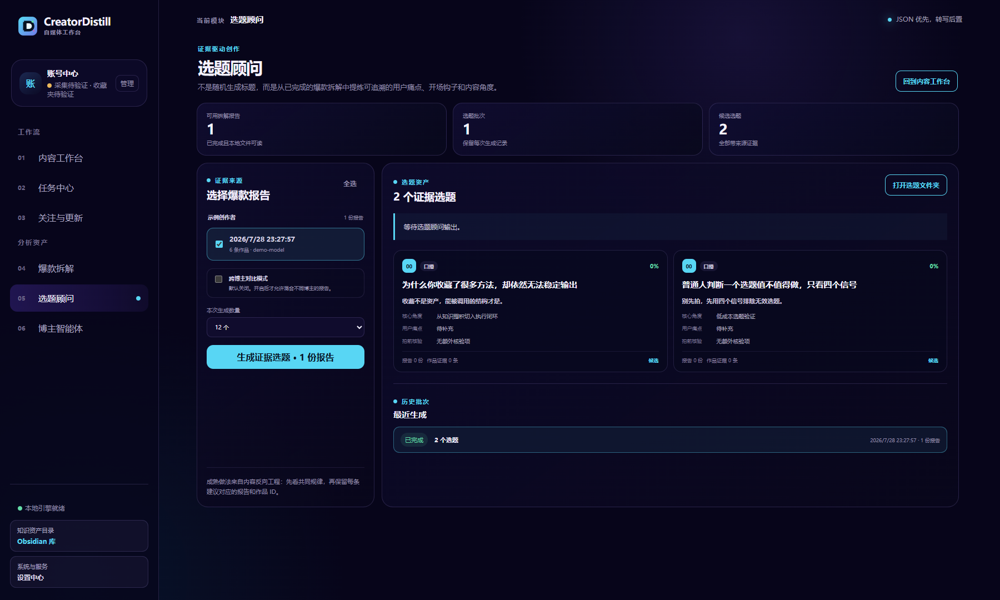
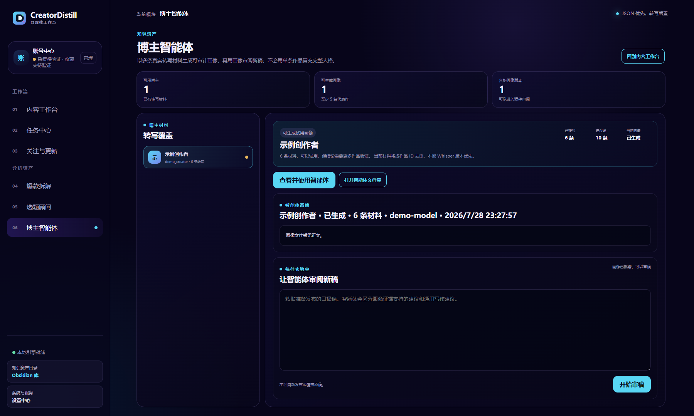
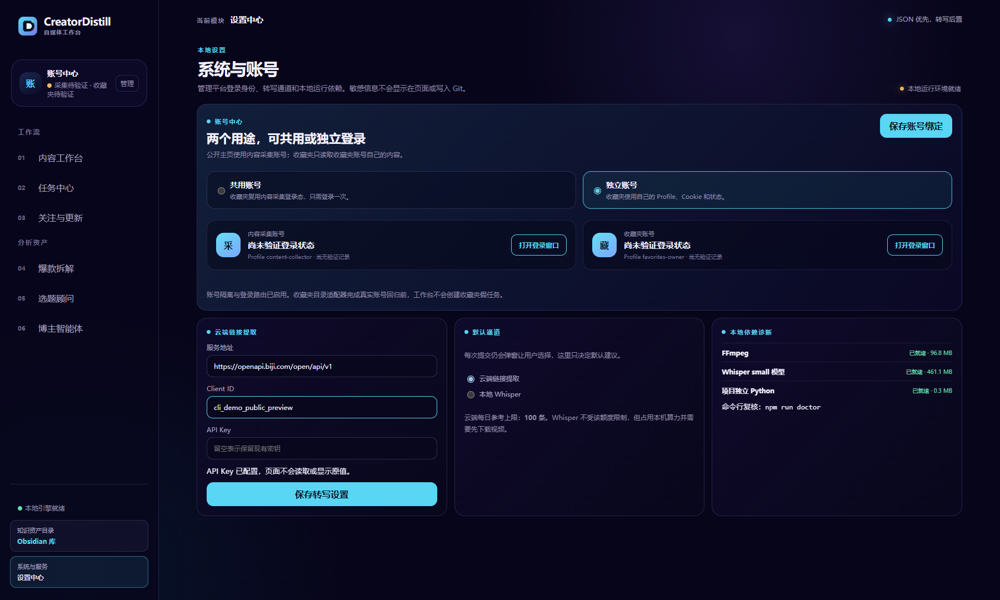

<div align="center">
  
</div>

<div align="center">

[](LICENSE)
[](package.json)
[](docs/本地转写运行环境.md)
[](SECURITY.md)

**把创作者主页和收藏夹，转化为可检索知识、爆款规律、选题资产和可调用的博主智能体。**

`Local-first creator intelligence agent for Douyin content, transcription, viral analysis and reusable creator personas.`

</div>

---

## 为什么做 CreatorDistill

刷到有价值的创作者后，真正困难的不是保存一条链接，而是：

- 如何批量获得作品目录，并知道有没有漏抓或混入非目标内容；
- 如何按日期、点赞和总互动筛选真正值得处理的作品；
- 如何把视频转成带来源、日期和作品 ID 的可追溯文本；
- 如何从多条作品中拆出稳定的爆款规律，而不是总结一条视频；
- 如何持续沉淀选题、知识资产和可审计的博主智能体。

CreatorDistill 将这些步骤拆成独立、可暂停、可复核的本地阶段。原始 JSON、转写文本、分析报告和任务状态分别落盘，不会在抓取结束后自动消耗模型额度。

<div align="center">
  
</div>

## 核心能力

| 模块 | 解决的问题 | 当前边界 |
| --- | --- | --- |
| 内容工作台 | 获取主页、单条作品和本人收藏夹目录；筛选并选择作品 | 需要本地 Chrome 登录；不承诺绕过验证码或平台限制 |
| JSON 证据层 | 按作品 ID 去重、数量审核、保留原始抓取证据 | 审核异常时允许查看，但锁定转写与分析 |
| 双通道转写 | 云端链接转写，或本地 FFmpeg + Whisper 转写 | 通道由用户提交任务时选择；本地通道需要安装运行依赖 |
| 任务中心 | 查看实时阶段、日志、失败原因和下一步操作 | 相同 Chrome Profile 串行执行，避免并发争抢 |
| 关注与更新 | 定期检查关注博主和收藏夹是否出现新增内容 | 只更新目录，不自动转写或调用模型 |
| 爆款拆解 | 基于多条已转写作品分析 Hook、结构、情绪和互动规律 | 单份报告最多 20 条，结论必须引用作品证据 |
| 选题顾问 | 从已完成的爆款报告生成带来源的选题 | 不从空白提示直接生成无证据标题 |
| 博主智能体 | 用多条代表性材料生成画像，并审阅新稿 | 明确“不是本人”，保留证据不足和矛盾项 |

<div align="center">
  
</div>

## 数据流

<div align="center">
  
</div>

关键原则是 **JSON 优先，转写后置，分析必须引用证据**：

1. 输入抖音号、主页链接、单条作品或本人收藏夹。
2. 先抓取并审核标准 JSON，确认数量、作品 ID 和关键字段。
3. 用户筛选作品，再选择云端或本地转写通道。
4. 转写完成后，才能进入爆款拆解、选题生成或知识蒸馏。
5. SQLite 保存任务、订阅、缓存和产物索引；Markdown/JSON 保存可迁移资产。

## 界面预览

所有公开截图均由本地演示数据生成，不包含真实账号、密钥或用户资产。

| 任务与证据状态 | 选题顾问 |
| --- | --- |
|  |  |
| **博主智能体** | **系统与账号** |
|  |  |

## 五分钟启动

### 1. 环境要求

- Windows 10/11
- Node.js 22.5 或更高版本（项目使用内置 `node:sqlite`）
- Google Chrome
- Git
- 可选：FFmpeg、Python、faster-whisper 和本地 Whisper 模型

### 2. 安装

```powershell
git clone https://github.com/wl1650918245/douyin-creator-distill.git
cd douyin-creator-distill
npm ci
```

### 3. 创建本地配置

```powershell
Copy-Item .env.example .env
Copy-Item config/model.config.example.json config/model.config.json
Copy-Item config/text-extraction.config.example.json config/text-extraction.config.json
Copy-Item config/transcription.config.example.json config/transcription.config.json
Copy-Item config/account-profiles.config.example.json config/account-profiles.config.json
```

配置文件只保存在本机，并已加入 `.gitignore`：

| 文件 | 用途 |
| --- | --- |
| `.env` | 知识资产根目录、默认 Chrome Profile |
| `config/account-profiles.config.json` | 内容采集账号与收藏夹账号绑定 |
| `config/text-extraction.config.json` | 云端链接转写服务 |
| `config/transcription.config.json` | 默认转写通道与本地 Whisper 配置 |
| `config/model.config.json` | 爆款拆解、选题和博主智能体使用的模型 |

### 4. 诊断并启动

```powershell
npm run doctor
npm start
```

打开 [http://127.0.0.1:8780/](http://127.0.0.1:8780/)。Windows 用户也可以双击 `start-app.cmd`。

> 不要直接双击 `index.html`。页面依赖本地 `/api/*` 接口和 SQLite 状态，`file://` 模式无法工作。

## 第一次使用

1. 打开左侧“账号中心”，登录内容采集账号。
2. 如需抓取本人收藏夹，可共用采集账号，也可以为收藏夹单独登录。
3. 回到内容工作台，输入抖音号、主页链接或点击“抓取我的收藏夹”。
4. 在任务中心观察抓取、审核和恢复 Loop。
5. JSON 审核通过后筛选作品，选择转写通道并提交。
6. 从已转写作品进入爆款拆解、选题顾问或博主智能体。

独立命令：

```powershell
npm run login:content
npm run login:favorites
npm run crawl:profile -- <douyin_id_or_profile_url> --dry
```

`--dry` 只验证输入、环境和执行计划，不执行真实抓取。

## 本地资产

默认目录是 `%USERPROFILE%\Documents\DouyinKnowledgeAssets`，可以通过 `.env` 中的 `KNOWLEDGE_ASSET_ROOT` 修改。

```text
DouyinKnowledgeAssets/
├─ raw/
│  ├─ douyin-analysis/      # 原始 JSON 证据
│  ├─ get-notes/            # 云端通道文本
│  └─ transcripts/          # 本地 Whisper 文本
├─ analyses/
│  ├─ viral-breakdowns/     # 爆款拆解
│  └─ topic-library/        # 选题资产
├─ agents/                  # 博主智能体与审稿记录
└─ .runtime/                # SQLite、任务与本地缓存
```

用户数据、Chrome Profile、API 密钥、SQLite、日志、模型和媒体文件均不会进入 Git。

## 恢复 Loop 与安全边界

目录任务使用有限恢复策略：

```text
Chrome 首轮
  └─ 审核未通过 → Chrome 恢复重试
       └─ 仍未通过 → 内部接口补充
            └─ 合并并再次审核
```

- 每轮原始 JSON 都会保留，并按 `videoId` 合并。
- 遇到登录失效、验证码、`403` 或 `429` 时停止自动请求，要求人工处理。
- 不使用接口切换绕过平台验证，不进行无限重试。
- 同一 Chrome Profile 同时只允许一个目录任务。
- 抓取完整度受登录状态、账号权限、网络、页面结构和平台策略影响。

## 项目状态

| 能力 | 状态 | 验证方式 |
| --- | --- | --- |
| 主页目录与 JSON 审核 | 已实现 | 多账号真实回归 + 自动化契约测试 |
| 收藏夹目录发现与选择抓取 | 已实现 | 单收藏夹真实回归 + 适配器测试 |
| 任务持久化与恢复 Loop | 已实现 | SQLite + `npm run test:loop` |
| 云端链接转写 | 已实现 | 真实单条转写回归 |
| 本地 Whisper | 已实现 | FFmpeg/模型诊断 + smoke 命令 |
| 爆款拆解 | 已实现 | 多作品报告落盘 |
| 选题顾问 | 已实现 | 浏览器 UI 回归 |
| 博主智能体与审稿 | 已实现 | 浏览器 UI 回归 + 审计门禁 |
| 收藏夹全目录数量对账 | 持续验证 | 尚未形成跨账号的完整回归证据 |
| 多用户、云数据库、计费 | 不在 v0.1.0 | 当前是单用户本地产品 |

## 开发与验证

```powershell
npm run check
npm run test:unit
npm run test:ui
npm run whisper:smoke
```

UI 测试需要本机 Chrome 和正在运行的 `npm start` 服务。真实抓取测试需要已经登录的平台账号。

## 文档

- [产品与工程规则](docs/product-engineering-charter.md)
- [产品架构](docs/product-architecture.md)
- [JSON 数据契约](docs/data-contract.md)
- [任务与历史契约](docs/task-history-contract.md)
- [分析产物契约](docs/analysis-output-contract.md)
- [账号体系规格](docs/账号体系规格.md)
- [本地转写运行环境](docs/本地转写运行环境.md)
- [关注与更新](docs/关注与更新.md)
- [Demo 验收说明](docs/Demo验收说明.md)
- [第三方软件与方法资料](THIRD_PARTY_NOTICES.md)

## 贡献

欢迎提交 Bug、文档改进、适配器测试和可复现的兼容性报告。提交前请阅读 [CONTRIBUTING.md](CONTRIBUTING.md) 和 [SECURITY.md](SECURITY.md)。

项目只会把“已经跑通并有实测证据”的能力写入稳定状态，不用设计目标替代运行证据。

## 合规声明

CreatorDistill 是独立的开源项目，与抖音或字节跳动不存在官方关联、授权或背书关系。请仅处理你本人拥有、公开可访问或已经获得授权的内容，并遵守所在地法律、平台规则、著作权和个人信息保护要求。

本项目不会承诺“100% 抓全”“永不触发风控”或无人值守绕过平台验证。

## License

[Apache License 2.0](LICENSE)。第三方 Skill 和方法资料继续遵循各自许可证，详情见 [THIRD_PARTY_NOTICES.md](THIRD_PARTY_NOTICES.md)。
