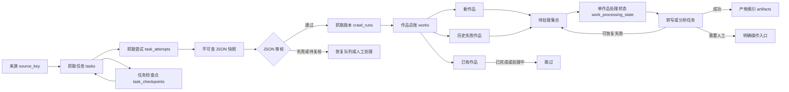

# 状态与数据流图

## 页面读取规则

- 内容工作台读取当前目录版本与作品总账。
- 任务中心读取任务、尝试和检查点。
- 关注与更新读取订阅、最新审核通过版本和作品总账汇总。
- 爆款拆解、选题顾问和博主智能体只读取已完成的标准文本产物。

## 文件与数据库边界

- JSON、Markdown、SRT 和分析报告是可查看、可迁移的业务资产。
- SQLite 保存身份、状态、检查点和文件索引。
- SQLite 可以从文件和历史任务重建，但重建过程必须有审计结果，不能猜测缺失字段。

